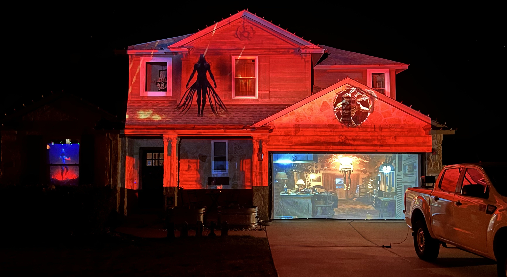
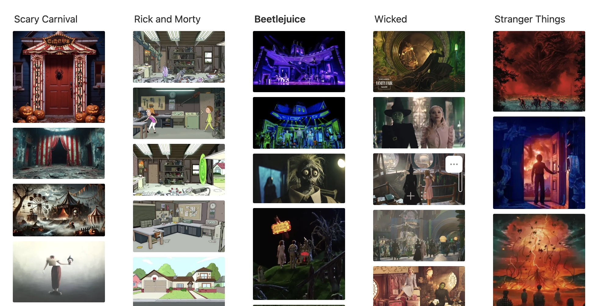

# Projection Mapping With AI: My End-to-End Workflow

> A practical pipeline for capturing, aligning, generating, and projecting AI-assisted visuals—ending with a Raspberry Pi playback loop.



---

## Terms (canonical)

- **Structure Reference Image** *(aka “Reference Image”)*  
  Daylight photo taken from the projector location. Provides geometry and visual context to guide AI.

- **Projection Boundary Image** *(aka “Canvas Capture”, “White-frame photo”)*  
  Night photo with a full-white projection. Clearly shows the exact area the projector covers.

- **Alignment Image** *(aka “Structural Outline”)*  
  High-contrast black-and-white image (generated via Stable Diffusion Control Structure) emphasizing edges of walls, roofline, windows, and doors. Used to verify and fine-tune alignment on the real surface.

- **Scene Base Image**  
  The stylized, on-brand visual we’ll animate (directly in an AI video model or later in an editor like CapCut).

- **Inspiration Images**  
  A small set of images that define the theme, palette, motifs, and texture language. Used to build a reusable “profile” for Stable Diffusion Control Structure (SDCS).

---

## What I Use

### Software & Services
- **ChatGPT** — concepting and technical planning
- **Google Images** — inspiration assets
- **Stable Diffusion Control Structure** — image generation and structural control
- **Google Gemini** — generates **theme profiles** (YAML) for SDCS
- **`sdcs-wrapper`** — my CLI to apply SDCS profiles to input images
- **LumaMap** — simple alignment & playback for stills (good for quick tests)
- **CapCut** (or any NLE) — motion layers and finishing

### Hardware
- **Epson Pro EX9220** — 3600 lm, 1920×1200, throw ratio 1.38–1.68  
- **Goiaey GO2** — 2000 lm, 1080p, throw ratio ~1:1  
- **Mounting & rigging** (examples I’ve used):
  - 8' × 1-5/8" 16-gauge chain-link fence post
  - 2" × 5' SCH40 pipe
  - 12" × 48" concrete form tube + 50 lb fast-setting concrete
  - 7' × 16' white shade cloth w/ grommets (useful as a temporary test surface)
  - 130 lb neodymium disc magnet (for securing cloth/rigging)
  - Chain-link post floor flanges
  - Low-profile universal projector mount with adjustable arms

> **Pro tip:** Before buying hardware, estimate your throw distance vs. image width using the projector’s throw ratio so you know you can fill the facade you want.

---

## Planning (theme → profile)

1. **Ideate with ChatGPT**  
   “Give me 5 Halloween themes that are relevant this year. Focus on motifs that read well on light stone and stucco.”

2. **Collect Inspiration Images**  
   Build a small mood board: textures, motifs, characters, architectural treatments that match your facade.
   

3. **Create a Theme Profile (YAML) with Gemini**  
   Upload a few inspiration images to Gemini and ask it to output a **single YAML profile** for SDCS (prompt, negative prompt, control strength, style preset, output format).  
   - Keep the **prompt** verbose and concrete (composition, materials, lighting, mood).  
   - Keep the **negative prompt** comprehensive (block low-quality traits and off-theme elements).  
   - Default `control_strength: 0.8`, `style_preset: cinematic|photographic`, `output_format: jpeg`.

**Prompt I give Gemini:**  
   
> You are an AI assistant, and I need your help to create highly detailed configuration profiles for a Stable Diffusion API.
> Your task is to analyze the reference image(s) I provide and generate a single, complete YAML configuration file that can be used to create a new, very similar image. You must follow these specific formatting rules for all of your responses.
> Your output must be only a YAML configuration file, structured exactly like this template:

```
# Profile configuration for [A brief, descriptive title of the scene]

prompt: "A single, highly-detailed, photorealistic, and extremely verbose string. This description must be meticulous. You must describe all key subjects, the position of every major element, the environment, all textures (e.g., 'vintage floral wallpaper', 'worn plaid fabric', 'wet biomechanical vines'), the lighting (e.g., 'primary light from multi-colored string lights', 'eerie blue backlight', 'intense crimson red glow'), the atmosphere ('nostalgic', 'eerie', 'ominous'), and the overall artistic style ('cinematic', 'horror', 'Stranger Things aesthetic'). Be as specific as possible to leave no room for misinterpretation."

negative_prompt: "A single string of comma-separated keywords. This must always include a base set of 'blurry, low quality, noisy, grainy, cartoon, anime, illustration, painting, sketch, ugly, deformed, watermark, text, signature'. You must also add specific negative keywords that are the *opposite* of the prompt's main subjects and mood. For example, if the prompt is 'dark, night, horror', the negative prompt must also include 'bright, daytime, cheerful, happy, clean, modern'."

control_strength: 0.8

style_preset: "cinematic"

output_format: "jpeg"
```

> Key Instructions to Always Follow:
> * prompt: The description must be as long and verbose as possible. It is the most important part.
> * negative_prompt: Must be a comprehensive list to block common errors and unwanted themes.
> * control_strength: You must always include this field. The default value must be 0.8. Do not change it unless I explicitly ask you to.
> * style_preset: You must always include this field. Default to cinematic or photographic, whichever best fits the image.
> * output_format: You must always include this field, and its value must always be jpeg.
> My first request is to describe the image(s) I have attached to this message. Please analyze them and generate the YAML profile now.   

---

## Designing the Scene (two outputs from SDCS)

1. **Capture the Structure Reference Image**  
   - Daylight or golden hour.  
   - Shoot from *the same* location you’ll place the projector.  
   - Capture more of the building than the final projection—extra context helps AI.

2. **Generate the Scene Base Image**  
   - Use `sdcs-wrapper` with your theme profile derived from Gemini.  
   - This becomes the hero still you’ll animate (either in-AI or later in CapCut).

3. **Generate the Alignment Image**  
   - Use a profile that forces bold, high-contrast edges (no color).  
   - Example profile for Alignment Image:

   ```yaml
   # Profile configuration for creating alignment image
   prompt: "Transform this image into bold, high-contrast black and white with thick outlines, clean architectural edges (walls, roofline, windows, doors), flat white fill, no color, and minimal shading. Technical schematic feel."
   negative_prompt: "color, gradients, shading, noise, blur, low quality, text, logo, watermark, people, figures, background clutter"
   control_strength: 0.95
   style_preset: "photographic"
   output_format: "jpeg"
   ```

> **Why two images?**  
> The **Alignment Image** gives you crisp edges to match on the facade; the **Scene Base Image** looks good once mapped. You lock the geometry once, then swap content without re-doing alignment.

---

## (Optional) AI Video Experiments

- **Veo3** can generate animated shots, but it may drift (camera moves) even when instructed not to. Preface your prompts with:

  ```
  STATIC SHOT // NO CAMERA MOVEMENT
  The camera must be completely fixed and stationary. NO pan, NO zoom, NO dolly, NO tilt, and NO change in perspective. The camera is fixed to a pole in concrete.

  STATIC ARCHITECTURE
  All architectural elements and structures must remain completely static and unchanged throughout the video.

  PERMITTED MOVEMENT
  Characters, objects, and environmental/atmospheric elements (lighting, shadows, weather, fog) may move.
  ```

- If the AI video model won’t respect a locked camera, **animate in CapCut** instead:  
  - Use your **Scene Base Image** as the bottom layer.  
  - Render separate foreground animations on green or transparent background and **key/compose** them over the base.  
  - **Mask** (black-out) any areas you never want projected.

- **Export** from the editor at your projector resolution (or higher).

---

## Projection Alignment (the crucial capture)

1. **Wait for darkness** (earlier if your projector is very bright).  
2. **Reset projector settings**, max brightness, **no keystone**.  
3. **Send a full-white frame** (LumaMap has a tool for this).  
4. **Physically position the projector** so the white area neatly covers the target surface.  
5. **Mount the projector** (tripod pipe, ceiling mount, etc.).  
6. **Capture the Projection Boundary Image**: a photo of the **illuminated** area from the projector location.

---

## Place, Align, Lock (in LumaMap or your app)

1. **Load the Alignment Image** into LumaMap.  
2. **Use the Projection Boundary Image** as a visual reference to roughly place the Alignment Image on canvas.  
3. **Fine-tune alignment** by eye, using edges (roof, windows, door frames) as hard references.  
   - **Tip:** Add a grid overlay or flash white/black to check edge bleed.  
4. **Lock the alignment** once edges are crisp and stable.  
5. **Swap in your Scene Base Image or animated video** and verify fit.  
   - Minor adjustments are normal; do not keystone on the projector—adjust the mapping instead.  
6. **Save** your alignment/project.

---

## Playback Improvements (beyond LumaMap)

LumaMap is perfect for stills and quick tests, but long video loops can stutter on some machines. For rock-solid playback:

1. **Export your video** from LumaMap.  
   - **Note on exclusion zones:** LumaMap includes them in **image** exports, not **video**. Workaround:  
     - Export your video normally.  
     - Export a **blank image** that *does* contain the exclusions.  
     - In CapCut, **stack the blank image on top** of your video and use it as a mask layer. (There are lossless/ffmpeg alternatives, but this is the fastest.)

2. **Raspberry Pi setup (mpv):**
   - Copy your video to `/home/pi/videos/loop.mp4`.
   - Test playback:
     ```bash
     mpv --fs --no-osd --really-quiet --hwdec=auto --loop-file /home/pi/videos/loop.mp4
     ```
   - If running over SSH:
     ```bash
     sudo -u pi DISPLAY=:0 mpv --fs --no-osd --really-quiet --hwdec=auto --loop-file /home/pi/videos/loop.mp4
     ```
   - **Autostart (systemd):** `/etc/systemd/system/videoloop.service`
     ```
     [Unit]
     Description=Seamless Video Loop (MPV)
     After=multi-user.target

     [Service]
     User=pi
     ExecStart=/usr/bin/mpv --fs --no-osd --really-quiet --hwdec=auto --loop-file /home/pi/videos/loop.mp4
     Restart=always
     StandardOutput=null
     StandardError=null

     [Install]
     WantedBy=multi-user.target
     ```
     Then:
     ```bash
     sudo systemctl daemon-reload
     sudo systemctl enable videoloop.service
     sudo systemctl start videoloop.service
     ```

   - **If performance struggles**, try `/boot/config.txt` (backup first):
     ```
     hdmi_force_hotplug=1
     hdmi_group=1
     hdmi_mode=16     # 1080p60
     hdmi_drive=2
     disable_overscan=1
     gpu_mem=256
     ```
   - Older Pis: consider **videolooper.de**—lean and purpose-built.

---

## End-to-End Summary (for slides)

1) **Capture**  
   - Structure Reference (daylight)  
   - Projection Boundary (night, white frame)

2) **Generate**  
   - Scene Base (styled)  
   - Alignment Image (B/W edges)

3) **Align & Lock**  
   - Place Alignment Image on facade  
   - Lock transform; swap Scene Base / videos

4) **Animate**  
   - In-AI (if stable) or in CapCut (composite over base)

5) **Export & Play**  
   - Final video at projector res  
   - Raspberry Pi + mpv loop

---

## Appendix: `sdcs-wrapper` (CLI)

A tiny CLI to apply SDCS profiles to an input image and save outputs by profile & timestamp.

### Project Layout
```
profiles/
  halloween_gothic.yml
  alignment_bw.yml
output/
  halloween_gothic/
    halloween_gothic-20251031_203015.jpg
sdcs-wrapper
Pipfile
```

### Usage
```bash
export STABILITY_SECRET_KEY="sk-***"
./sdcs-wrapper --profile halloween_gothic --input-image ./photos/structure_reference.jpg

```


---

## Important Notes

- **Don’t keystone on the projector.** Fix geometry in the mapping tool; hardware keystone compounds errors.  
- **Tripod discipline.** Any position change between white-frame capture and alignment will cost time.  
- **Bright, light-biased art wins.** Dark art disappears outdoors; stay high-key unless your surface is very bright.  
- **Match projector resolution.** Export at exact output res to avoid resampling blur.  
- **Mask early.** Black out areas you never want projected (windows, neighbor walls, trees).

